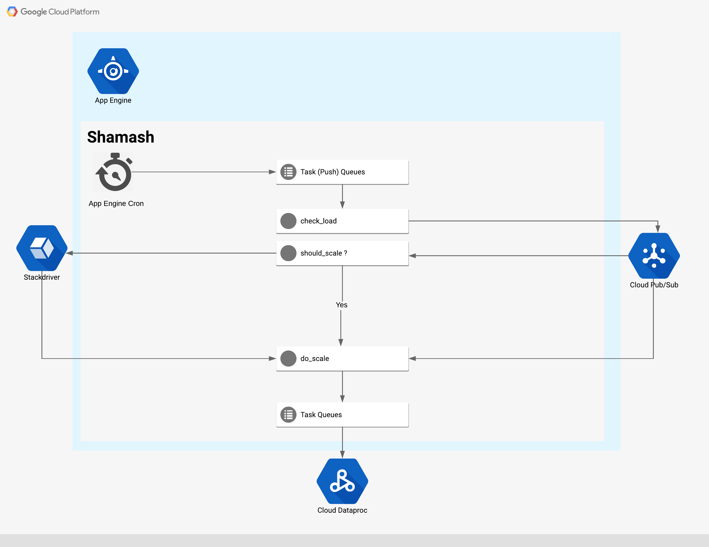

# Shamash - Autoscaling for Dataproc
Shamash is a service for autoscaling Cloud DataProc on Google Cloude Platform(GCP).
treams

[Shamash](https://www.wikiwand.com/en/Shamash) was the god of justice in Babylonia and Assyria, just like
the Shamash autoscaler whose job is to continuously maintain a tradeoff between costs and
performance.

## Background
Cloud Dataproc is a fast, easy-to-use, fully-managed cloud service for running Apache Spark and Apache Hadoop clusters in a simpler, more cost-efficient way. Operations that used to take hours or days take seconds or minutes instead, and you pay only for the resources you use (with per-second billing). Cloud Dataproc also easily integrates with other Google Cloud Platform (GCP) services, giving you a powerful and complete platform for data processing, analytics and machine learning.
Due to different usage patterns (e.g., high load during work hours, no load over night), the cluster may become either underprovisioned (users experience bad performance) or overprovisioned (cluster is idle, causing a waste of resources and unnecessary costs).

However, while autoscaling has become state-of-the-art for applications in GCP, currently there exists no out-of-the-box solution for autoscalingof a Dataproc clusters.

The "Shamash" autoscaling tool actively monitors the performance of a Dataproc clusters and automatically scales the cluster up and down where appropriate. Shamash adds and remove nodes based on the current load of the cluster.

Shamash is build on top of Google App Engine utilizing a serveries architecture. 

### Highlights
* Serverless operation
* Support multiple clusters (each with his own configuration)
* Works without any change to the cluster

## Instalation
Shamash requires both Google Compute Engine, Google Cloud Pub/Sub, Dataproc API and Stackdriver APIs to be enabled in order to operate properly.

**To enable an API for your project:**

1. Go to the [Cloud Platform Console](https://console.cloud.google.com/).
2. From the projects list, select a project or create a new one.
3. If the APIs & services page isn't already open, open the console left side menu and select APIs & services, and then select Library.
4. Click the API you want to enable. ...
5. Click ENABLE.

##### Install dependencies

`pip install -r requirements.txt -t lib`

##### Deploy
`./deploy.sh project-id`

## Architecture

Flow

* Every 5 minutes a cron job calls `/tasks/check_load` which create a task per clusterin the task queue.
* Each task is requesting `/do_monitor` with the cluster name as a paramter.
* `/do_monitor` calls `check_load()`
* `check_load()` get the data from the cluster and publish it to pub/sub`pubsub.publish(pubsub_client, msg, MONITORING_TOPIC)`
* `/get_monitoring_data` in invoked when there is new message in the monitoring topic and calls should_scale
* should_scale descide if we should scale. if yes trigger_scaling which put data into pub/sub scaling topic
* `/scale` invokes, gets the message from pub/sub and  calls `do_scale`
* Once the calculation are done the cluster is ptached with a new number of nodes.

### Local Devlopment
For local development run:

 `dev_appserver.py --log_level=debug app.yaml`

  you will need a local config.json file in the follwoing structure

`{
"project": "project-id"
}`
